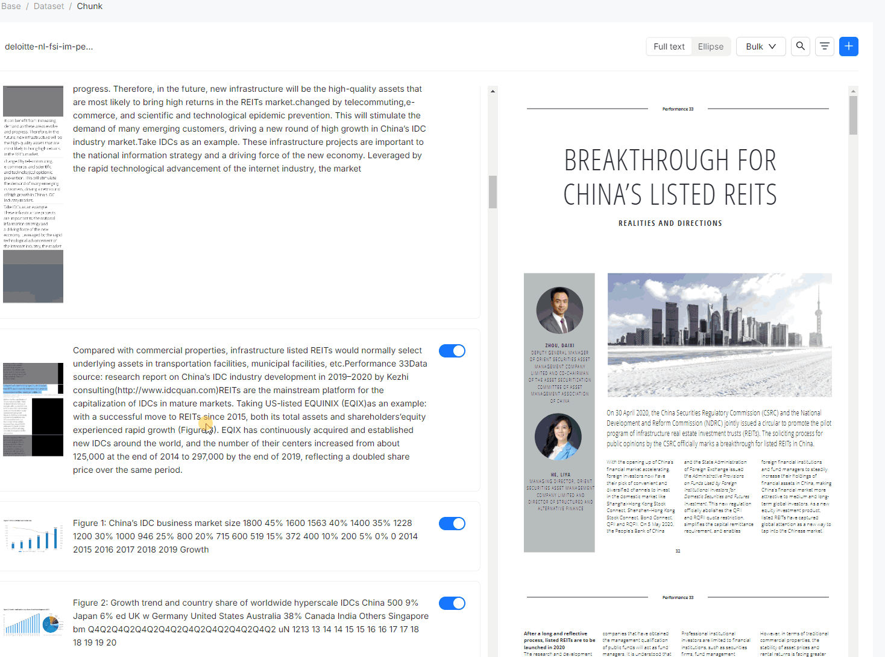

# RAGFlow CI/CD pipeline

Deploy RAGFlow with CI/CD on Elestio

 
 

# Once deployed ...

For your first connection, you must first create a user

You can open RAGFlow UI here:

    URL: https://[CI_CD_DOMAIN]

You can open PHPMyAdmin here:

    URL: https://[CI_CD_DOMAIN]:14700
    login: root
    password: [ADMIN_PASSWORD]
